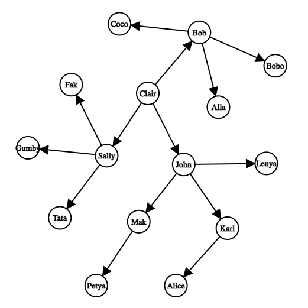

# Organization hierarchy
Finding the Lowest Common Ancestor (LCA) in a organization hierarchy using upward traversal

# Technical details
1. Upward traversal algorithm
2. Data structure for storing tree: Adjacency List
3. Time complexity of finding the LCA using upward traversals : O(N), where N is the number of nodes in the tree

# Assumptions
1. Task is a typical lowest common ancestor problem.
2. I choose the Upward tree traverse algorithm, though there are more performant algorithms with preprocessing.
    a. The main advantage of using the Upward algorithm it doesn't require precomputation, which means we can use it online.
    b. I assume Bureaucr.at is a startup with a high hire/churn employee rate, so we need an algorithm capable of dealing with frequent hierarchical changes.
3. There are cases when a node can be an ancestor of itself. I will assume that if the node doesn't have any manager it will report to itself.
4. I will assume that hierarchy is not cyclic. So that it cannot be that John is reporting to Sally and at the same time that Sally is reporting to John.

# Configuration
1. Hierarchy can be customized using 'resources/hierarchy.json' file, where key is manager name and key list is manager's employee list
```json
{
  "Clair": ["Bob", "Sally", "John"],
  "Bob": ["Alla", "Bobo", "Coco"],
  "Sally": ["Tata", "Fak", "Gumby"],
  "John": ["Mak", "Karl", "Lenya"],
  "Mak": ["Petya"],
  "Karl": ["Alice"]
}
```

# Run server
```shell script
go run cmd/server/main.go
```
# Run using docker-compose
```shell script
docker-compose up
```
# Run using Helm
```shell script
cd helm && helm install org-hierarchy .
```

# Find common manager between two employees
```shell script
curl -i http://127.0.0.1:8080/common/manager?employees=Mak,Tata
```

